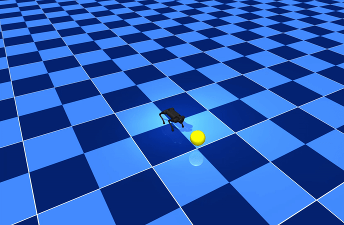
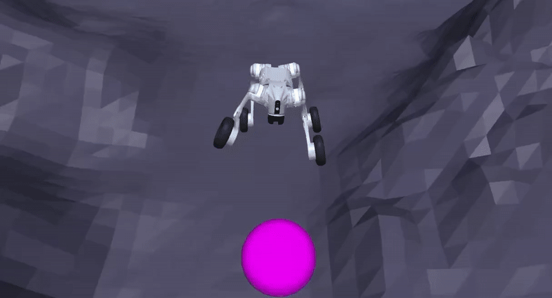
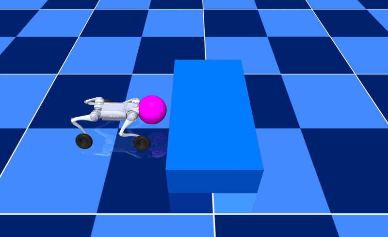
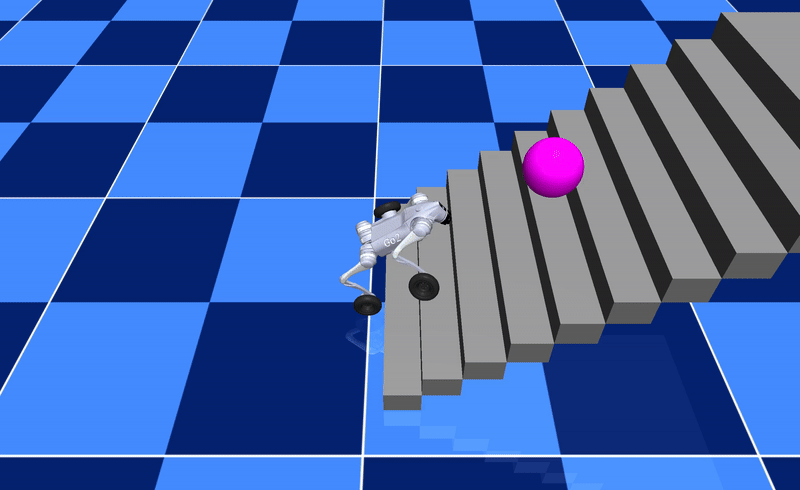
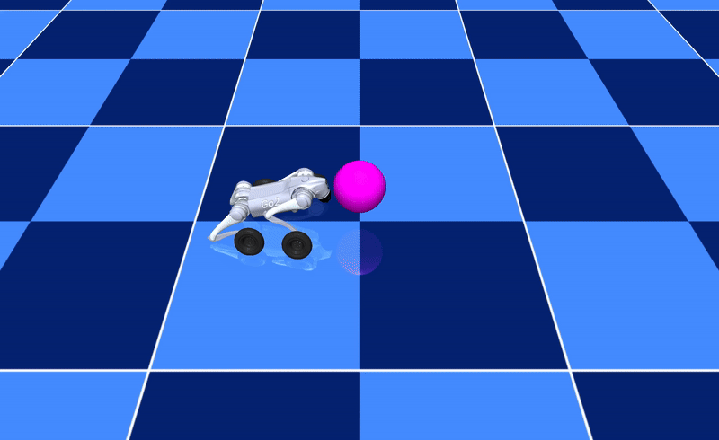

# Whole-Body MPPI for Wheeled Quadruped

<p align="center">
  
  
  
  <!-- 
   -->
</p>

This repository adapts the original **Whole-Body MPPI** controller (Alvarez-Padilla *et al.*) as inspiration for real-time Model Predictive Path Integral (MPPI) control of a wheeled quadruped platform. Our implementation extends the legged quadruped example to the Unitree Go2W wheeled–legged robot, enriching the action space and cost function to support wheel-velocity regulation and hybrid locomotion behaviors.

---
# Abstract

We present a real-time whole-body motion planning framework that extends Model Predictive Path Integral (MPPI) control from purely legged quadrupeds to wheeled–legged robots. Building on the Unitree Go2W platform, we augment the action space with four wheel–torque channels and enrich the running cost with (i) wheel-velocity regulation, (ii) a PD-shaped joint effort term, and (iii) an L1 penalty on base positional drift. A wheel-aware modification of the Raibert heuristic guides joint–angle sampling, while soft joint-limit penalties maintain mechanical feasibility.

Simulation studies demonstrate agile behaviors that are difficult for purely legged systems: rolling stair ascent, fast rough-terrain traversal, a stable 35 cm box jump, and waypoint following on flat ground. Compared with a leg-only baseline, the wheeled controller reduces traversal time by 55.7% and achieves 134.5% greater forward velocity on rough terrain while keeping wheel–ground contact smooth. The entire pipeline operates without offline learning or precomputed contact schedules, highlighting MPPI’s ability to handle the hybrid dynamics of wheeled–legged locomotion in a uniform sampling-based fashion.

These results indicate that sampling-based MPC can serve as a unified control layer for future multi-modal robots that must seamlessly switch between walking, rolling, and jumping in unstructured environments.

# Contribution of the Wheeled Controller Over the Legged Controller

The wheeled controller extends the baseline legged MPPI framework with key enhancements that significantly improve performance:

- **Extended Action Space**: Adds four wheel-torque channels to enable active rolling dynamics in addition to leg motion.
- **Enhanced Cost Terms**:
  - **Wheel-Velocity Regulation**: Enforces smooth and energy-efficient wheel contact.
  - **PD Joint-Effort Penalty**: Encourages conservative joint torques.
  - **L1 Positional Drift Penalty**: Penalizes base displacement errors without requiring direct Cartesian tracking.
- **Modified Raibert Heuristic**: Anticipates wheel effects on foot placement by offsetting foot targets using wheel speed, improving traction and contact stability.
- **Performance Gains**:
  - **Rough Terrain**: 55.7% reduction in traversal time and 134.5% increase in forward velocity compared to legged baseline.
  - **Box Jump and Stair Climb**: Enables high-clearance jumps and robust stair climbing via hybrid rolling-lifting dynamics.
- **Unified Framework**: Achieves all behaviors using the same MPPI controller—no need for separate planners, precomputed contact schedules, or learning-based components.

These innovations demonstrate the controller’s ability to generalize over multi-modal terrain tasks using a principled sampling-based MPC framework.

---

## Release Notes

* 🤖🐕 **2024/11/21** First release of Whole-Body MPPI project: complete MPPI controller implementations, general locomotion, stair climbing, and box-pushing tasks, plus interactive notebooks.
* 🚗🔄 **2025/05/12** Adaptation for wheeled quadruped (Go2W): enriched action space, wheel-velocity regulation, new gait configs, and updated cost functions.

---

## Contents

- [Installation](#installation)
- [Steps](#steps)
- [Locomotion Tasks](#locomotion-tasks)
- [Simulation](#simulation)
- [Definitions](#definitions)
- [Hyperparameter Configuration](#hyperparameter-configuration)
- [Simulation Parameters](#simulation-parameters)
- [Cost Weights](#cost-weights)
- [Temperature (λ)](#temperature-λ)
- [Robot Models & Task Scenes](#robot-models--task-scenes)
- [Directory Structure](#directory-structure)
- [References](#references)
- [License](#license)

---

## Installation

### Prerequisites
- Python 3.9 or higher  
- MuJoCo 2.3 or newer  
- [Conda](https://docs.conda.io/en/latest/) (recommended)

### Setup
```bash
conda create --name wheeled-mppi python=3.9 -y
conda activate wheeled-mppi
pip install -e .
```

---

## Steps

1. **Create environment**
   ```bash
   conda create --name wheeled-mppi python=3.9 -y
   conda activate wheeled-mppi
   ```
2. **Install package**
   ```bash
   pip install -e .
   ```

---

## Locomotion Tasks

Defined in `legged_mppi/utils/tasks.py`. Each task specifies goals, orientations, velocities, and gait patterns.

<center>

| **Rolling Gait on Rough Terrain**                         | **Walk Waypoints**                     |
|:-----------------------------------------:|:------------------------------------:|
|  |  |

| **Big Box**                              | **Stairs**                           |
|:-----------------------------------------:|:------------------------------------:|
|       |       |

</center>

---

## Simulation

Make sure to run all commands from within the `legged_mppi` directory:
```bash
cd legged_mppi
python simulate_mppi.py --task <task_name>
```

### Available Tasks
- `walk_straight`
- `roll_straight`
- `big_box`
- `stairs`

### Example
```bash
python simulate_mppi.py --task stairs
```

---

## Definitions

| **Parameter**           | **Description**                                                                 |
|-------------------------|---------------------------------------------------------------------------------|
| `goal_pos`             | List of 3D goal positions `[x, y, z]`                                           |
| `default_orientation`  | Goal orientation as quaternion `[w, x, y, z]`                                   |
| `cmd_vel`              | Commanded velocity `[linear_x, linear_y, angular_z]`                           |
| `goal_thresh`          | Threshold distances to consider goal reached                                   |
| `desired_gait`         | Gait patterns (`walk`, `sit`, `in_place`, `wheeled`)                           |
| `waiting_times`        | Timesteps to wait at each goal position                                         |
| `model_path`           | Path to robot MuJoCo XML model                                                   |
| `config_path`          | YAML file defining MPPI parameters                                              |
| `sim_path`             | MuJoCo scene XML file for task environment                                       |

---

## Hyperparameter Configuration

Located in `legged_mppi/control/controllers/configs` YAML files.

Key parameters include:
- `dt`: time step size
- `horizon`: planning horizon length
- `n_samples`: number of rollouts per iteration
- `noise_sigma`: trajectory noise standard deviation
- `lambda`: temperature parameter (balance exploration/exploitation)

---

## Simulation Parameters

- **Time step (`dt`)**: simulation integration step
- **Horizon length**: number of future steps in optimization
- **Number of samples**: rollouts per MPPI iteration
- **Noise sigma**: standard deviation for action perturbations

---

## Cost Weights

Defined in YAML config as matrices/vectors:
- **State cost (`Q`)**: penalize state deviation
- **Control cost (`R`)**: penalize control effort
- **Gait cost**: penalize undesired gait switches

---

## Temperature (λ)

Controls trade-off between trajectory cost minimization and stochastic exploration in MPPI.

---

## Robot Models & Task Scenes

Located under `legged_mppi/models`:

- **common.xml**: shared robot definitions and sensors
- **go1/**: legged quadruped URDF and assets
- **go2w/**: wheeled–legged adaptation URDF, assets, and hybrid base description
- **scene_*.xml**: MuJoCo environments for each task (e.g., big_box.xml, stairs.xml)

---

## Directory Structure

```bash
tree -I "*.pyc|__pycache__" -L 2
├── legged_mppi
│   ├── control
│   │   ├── controllers
│   │   │   ├── base_controller.py
│   │   │   ├── configs
│   │   │   │   ├── mppi_gait_config_big_box.yml
│   │   │   │   ├── mppi_gait_config_big_box_go2w.yml
│   │   │   │   ├── mppi_gait_config_stairs.yml
│   │   │   │   ├── mppi_gait_config_stairs_go2w.yml
│   │   │   │   ├── mppi_gait_config_walk.yml
│   │   │   │   └── mppi_gait_config_walk_go2w.yml
│   │   │   ├── mppi_locomotion.py
│   │   │   └── mppi_locomanipulation.py (unused)
│   │   └── gait_scheduler
│   │       ├── gaits
│   │       │   ├── FAST
│   │       │   │   └── *.tsv
│   │       │   ├── MED
│   │       │   │   └── *.tsv
│   │       │   ├── SLOW
│   │       │   │   └── *.tsv
│   │       │   └── WHEELED
│   │       │       └── *.tsv
│   │       └── scheduler.py
│   ├── interface
│   │   ├── configs
│   │   │   └── simulator.yml
│   │   ├── simulator.py
│   │   └── simulator_go2w.py
│   ├── models
│   │   ├── common.xml
│   │   ├── go1
│   │   │   ├── assets
│   │       │   └── *.stl
│   │   │   └── urdf
│   │   │       └── go1.urdf
│   │   └── go2w
│   │       ├── assets
│   │       │   └── *.stl
│   │       └── urdf
│   │           └──	go2w_description.urdf
│   ├── utils
│   │   ├── tasks.py
│   │   └── transforms.py
│   ├── simulate_mppi.py
│   └── MUJOCO_LOG.TXT
├── LICENSE
├── pyproject.toml
├── requirements.txt
├── setup.py
└── README.md
```

---

## References

Original MPPI source code inspiration:
```bibtex
@article{alvarez2024realtime,
  title={Real-Time Whole-Body Control of Legged Robots with Model-Predictive Path Integral Control},
  author={Alvarez-Padilla, Juan and Zhang, John Z. and Kwok, Sofia and Dolan, John M. and Manchester, Zachary},
  year={2024},
  note={arXiv:2409.10469}
}
```

Our wheeled quadruped adaptation:
```bibtex
@inproceedings{kou2025wheeled,
  title={{Whole Body Control of a Wheeled Quadruped using MPPI}},
  author={Kou, Henry and Olin, Gabriel and Li, Benji and Liu, Wensen},
  year={2025},
  note={CMU Robotics Institute Course Project}
}
```

---

## License

This project is licensed under the [MIT License](./LICENSE). Feel free to use and modify.